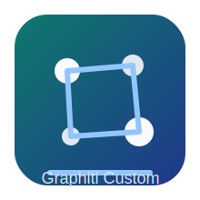
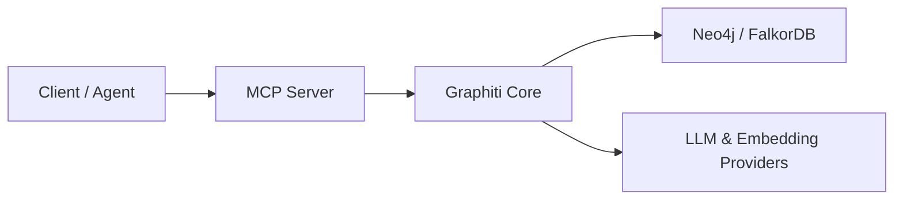

<p align="center">
  
</p>

<h1 align="center">时序记忆图引擎 Graphiti Custom</h1>
<p align="center">Temporal Context Graph Engine for AI Agents</p>

<p align="center">
  
  
  
  
  
</p>

---

## 目录 Contents

- [1. 项目简介 Project Overview](#1-项目简介-project-overview)
- [2. 我的改造目标 My Fork Goals](#2-我的改造目标-my-fork-goals)
- [3. 核心能力 Core Capabilities](#3-核心能力-core-capabilities)
- [4. 与原版实现差异 Key Differences](#4-与原版实现差异-key-differences)
- [5. 架构与目录 Architecture & Layout](#5-架构与目录-architecture--layout)
- [6. 快速开始 Quick Start](#6-快速开始-quick-start)
- [7. 配置说明 Configuration](#7-配置说明-configuration)
- [8. 部署方式 Deployment](#8-部署方式-deployment)
- [9. 开发与测试 Dev & Test](#9-开发与测试-dev--test)
- [10. 发布流程 Release Flow](#10-发布流程-release-flow)
- [11. 二次开发建议 Extension Guide](#11-二次开发建议-extension-guide)
- [12. 协议与许可 Terms & License](#12-协议与许可-terms--license)

---

## 1. 项目简介 Project Overview

`Graphiti Custom` 是一个面向 AI Agent 场景的时序上下文图引擎。它用于把对话、文档、业务事件持续写入图结构，并支持按时间、实体关系、语义相似度进行联合检索。

与传统“静态知识库 + 向量检索”相比，这个项目强调三个能力：

1. 时序事实管理（Temporal Facts）
2. 关系可追溯（Episode Provenance）
3. 图检索 + 语义检索混合召回（Hybrid Retrieval）

项目由两个可独立使用的部分组成：

- `graphiti_core/`：核心图构建与检索能力
- `mcp_server/`：可直接接入 Claude/Cursor 等客户端的 MCP 服务层

---

## 2. 我的改造目标 My Fork Goals

本仓库围绕“可作为个人/团队自有项目长期维护”进行了工程化重构，目标是：

1. 保留上游成熟能力并强化本地部署体验。
2. 将配置改为环境变量优先，避免敏感信息硬编码。
3. 提供 OpenAI 兼容端点（含本地 Ollama）更顺滑的接入路径。
4. 统一项目品牌、命名、文档语言与交付规范。
5. 让仓库具备“可演示、可部署、可继续演进”的形态。

---

## 3. 核心能力 Core Capabilities

### 3.1 图构建 Graph Construction

- 基于 Episode 持续增量写入图数据
- 支持实体、关系、摘要的结构化抽取
- 保留事实有效期与演化历史

### 3.2 检索能力 Retrieval

- 语义检索（Embedding）
- 关键词检索（BM25）
- 关系/结构检索（Graph Traversal）
- 面向时序查询的过滤能力

### 3.3 MCP 服务化 MCP Integration

- `mcp_server` 提供标准 MCP 工具接口
- 支持 episode 写入、节点查询、事实查询、清理维护
- 支持 HTTP / stdio 两种接入方式

### 3.4 多后端支持 Multi Backend

- Neo4j
- FalkorDB（默认）

---

## 4. 与原版实现差异 Key Differences

当前版本新增/调整重点如下：

1. 项目元数据品牌化：`graphiti-custom-core` / `graphiti-custom-mcp-server`
2. 新增仓库设置模板：`.github/settings.yml`（名称、描述、Topics）
3. 新增项目协议文档：`PROJECT_TERMS.md`
4. 新增 Logo：`images/graphiti-custom-logo.svg`
5. 根目录 `.env.example` 改为本地优先配置模板
6. `mcp_server/.env.example` 新增可直接复制的启动模板
7. `mcp_server/config/config.yaml` 改为环境变量驱动并给出本地默认值
8. OpenAI 工厂重构：支持 `api_url` 标准化并自动补全 `/v1`
9. OpenAI 工厂重构：支持本地 OpenAI 兼容端点无 key 回退（默认 `ollama`）
10. OpenAI 工厂重构：透传 `organization_id`
11. Embedder 工厂同步支持上述能力
12. 新增单测：`mcp_server/tests/test_openai_compatibility.py`
13. 新增运维探针：`/live`、`/ready`、`/metrics`
14. 新增队列观测工具：`get_queue_status`
15. 新增发版治理：`CHANGELOG.md`、`.github/RELEASE_TEMPLATE.md`

---

## 5. 架构与目录 Architecture & Layout

```text
.
├── graphiti_core/               # 核心图引擎
├── mcp_server/                  # MCP 服务层
│   ├── config/                  # YAML 配置
│   ├── src/                     # 服务实现
│   └── tests/                   # 测试
├── server/                      # 参考服务
├── examples/                    # 用例样例
├── images/                      # 文档资源
├── pyproject.toml               # 核心包配置
└── README.md
```



---

## 6. 快速开始 Quick Start

### 6.1 环境要求

- Python `3.10+`
- `uv`（推荐）或 `pip`
- Neo4j 或 FalkorDB
- OpenAI 兼容 API（可选本地 Ollama）

### 6.2 安装核心包

```bash
uv sync
```

或

```bash
pip install -e .
```

### 6.3 启动 MCP 服务

```bash
cd mcp_server
uv sync
uv run main.py --transport http
```

默认访问地址：`http://0.0.0.0:8000/mcp/`

---

## 7. 配置说明 Configuration

### 7.1 推荐做法

1. 复制 `.env.example` 为 `.env`
2. 仅在 `.env` 写入真实密钥
3. `config.yaml` 只保留结构和非敏感默认值

### 7.2 本地 Ollama 示例

```bash
OPENAI_API_KEY=ollama
OPENAI_API_URL=http://127.0.0.1:11434/v1
LLM_PROVIDER=openai
LLM_MODEL=gpt-oss:20b
```

### 7.3 数据库示例

```bash
DATABASE_PROVIDER=falkordb
FALKORDB_URI=redis://127.0.0.1:6379

# or
DATABASE_PROVIDER=neo4j
NEO4J_URI=bolt://127.0.0.1:7687
NEO4J_USER=neo4j
NEO4J_PASSWORD=change-me
```

---

## 8. 部署方式 Deployment

### 8.1 本地开发 Local Dev

- 适合功能验证、调试、个人学习
- 建议使用 FalkorDB + Ollama 组合进行低成本联调

### 8.2 Docker 方式 Docker

```bash
cd mcp_server
docker compose up
```

### 8.3 生产化建议 Production Notes

1. 将密钥迁移到 Secret Manager。
2. 为图数据库开启备份与监控。
3. 把并发参数 `SEMAPHORE_LIMIT` 与模型配额联动。
4. 将图维护操作纳入运维任务（索引检查、数据清理）。

---

## 9. 开发与测试 Dev & Test

```bash
# root
uv run pytest

# mcp server
cd mcp_server
uv run pytest tests/test_openai_compatibility.py
```

代码质量建议：

```bash
uv run ruff check .
uv run ruff format .
```

## 10. 发布流程 Release Flow

```bash
# 生成发布草稿
bash scripts/generate_release_notes.sh v1.1.0
```

发布建议配套文件：

- `CHANGELOG.md`
- `.github/RELEASE_TEMPLATE.md`
- `.github/pull_request_template.md`
- `docs/COMPATIBILITY.md`
- `docs/RUNBOOK.md`

---

## 11. 二次开发建议 Extension Guide

可优先扩展的方向：

1. 增加业务专属 `entity_types`。
2. 接入自定义 reranker。
3. 为不同知识域设置独立 `group_id`。
4. 增加查询审计日志与成本统计。
5. 增加跨租户隔离策略。
6. 引入数据生命周期策略（TTL、归档、脱敏）。

---

## 12. 协议与许可 Terms & License

- 上游代码许可：`Apache-2.0`（见 `LICENSE`）
- 本项目协作条款：见 `PROJECT_TERMS.md`
